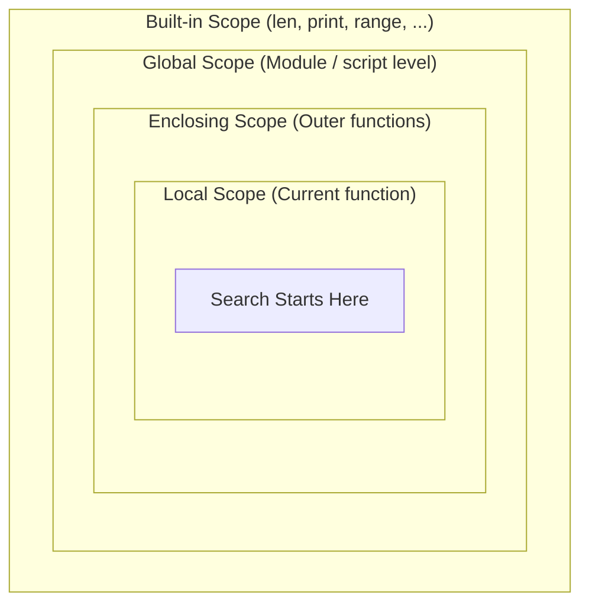
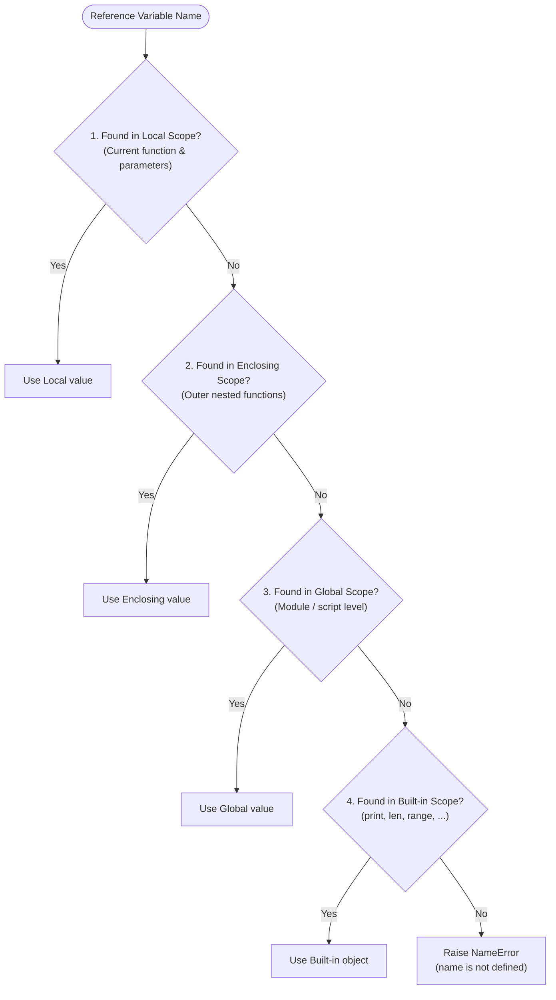

# Scope and Namespaces (The LEGB Rule)

In the previous lesson, we learned how to package code into reusable blocks using functions. But as soon as you start writing functions, questions immediately come up:

- *Why can't I access a variable outside the function where it was created?*
- *Why does changing a variable inside a function sometimes leave the original variable completely untouched?*
- *Why did my code suddenly crash with `UnboundLocalError` when I tried to update a counter?*
- *Why does Python break if I name a list variable `list = [1, 2, 3]`?*

All of these behaviors are governed by two fundamental concepts in Python: **Namespaces** and **Scope**.

Understanding how Python tracks names and where it looks for them is the difference between guessing why your code works and writing predictable, clean, and bug-free programs.

---

## Lesson Overview {#overview}

By the end of this lesson, you will:

- Understand what a **namespace** is and how Python uses it to map names to objects.
- Distinguish between a **namespace** (where names live) and **scope** (where names are accessible).
- Know the **lifetimes** of different namespaces during program execution.
- Trace name resolution step-by-step using the **LEGB rule** (Local, Enclosing, Global, Built-in).
- Understand how variable reassignment creates local variables by default.
- Use the `global` and `nonlocal` keywords correctly while understanding why relying on them is usually discouraged.
- Recognize and avoid common pitfalls like variable shadowing and `UnboundLocalError`.

---

## Conceptual Overview

### Namespaces: The Dictionaries of Python

A **namespace** is simply a container that maps names (identifiers) to objects.

Think of a namespace like the contact list in your phone:
- The "name" is the contact entry (e.g., `"Mom"` or `"Alex"`).
- The "object" is the actual phone number and person behind it.

If two different people have a contact named `"Alex"` on their separate phones, there is no confusion because each `"Alex"` lives inside a completely separate contact list. 

In Python, namespaces work the exact same way. In fact, most namespaces in Python are implemented under the hood as standard Python **dictionaries**, where the keys are the variable names (strings) and the values are the objects themselves!

This idea is so central to Python's architecture that Tim Peters included it as the final line of *The Zen of Python*:

> *"Namespaces are one honking great idea — let's do more of those!"*

### Scope: The Visibility Zone

While a **namespace** is the physical container (the dictionary mapping names to objects), **scope** is the *textual region of a program* where a namespace is directly accessible without needing special prefixes.

In other words:
- **Namespace:** "Where does this name live?"
- **Scope:** "From where in my code can I see and use this name?"

---

## The Four Namespaces and Their Lifetimes

A Python program can have up to four types of namespaces active at various times. Each namespace has a distinct **lifetime**—meaning Python creates it when needed and destroys it when it's done:

| Namespace | When It Is Created | When It Is Destroyed | Example Contents |
| :--- | :--- | :--- | :--- |
| **Built-in** | When Python starts up. | When Python exits. | `print()`, `len()`, `range()`, `int`, `str` |
| **Global** | When the main script starts or a module is imported. | When the interpreter terminates. | Variables and functions defined at top level |
| **Enclosing** | When an outer function containing nested functions is called. | When that outer function finishes executing. | Variables in an outer function accessible to inner functions |
| **Local** | When a function is called. | When that function returns or finishes. | Parameters and variables created inside the function |

:::tip Notice the Lifetimes
Because a function's **local namespace** is created freshly every time the function is called and deleted as soon as it returns, variables defined inside a function do not survive after the function finishes!
:::

---

## The LEGB Rule: How Python Finds Names

When you reference a variable name in your code, Python doesn't search randomly. It follows a strict, inside-out lookup order known as the **LEGB rule**:

1. **L — Local:** Names assigned inside the current function or lambda (including its parameters).
2. **E — Enclosing:** Names in the local scope of any enclosing (outer) functions, searched from the nearest enclosing function outward.
3. **G — Global:** Names assigned at the top level of the current module or script.
4. **B — Built-in:** Names pre-loaded by Python's built-in module (such as `print`, `len`, `sum`, `Exception`).

If Python searches through all four levels and still cannot find the name, it stops and raises a **`NameError`**.



The step-by-step decision flow when resolving any variable:



Let's see the LEGB rule in action step-by-step.

### 1. Local vs. Global

When a variable exists in both the global and local scopes, the local variable takes precedence inside that function:

```python interactive debug
x = "global x"

def show_value():
    x = "local x"
    print("Inside function:", x)

show_value()
print("Outside function:", x)
```

Notice what happened:
- Inside `show_value()`, Python checked **Local** first. It found `x = "local x"` and printed it.
- Outside the function, only the **Global** scope exists, so `x` is still `"global x"`. The assignment inside `show_value()` created a brand new local variable without touching the global one.

### 2. Enclosing Scope (Nested Functions)

In Python, you can define a function inside another function. The outer function creates an **Enclosing** scope for the inner function:

```python interactive debug
greeting = "Hello from Global"

def outer():
    greeting = "Hello from Enclosing"

    def inner():
        print(greeting)

    inner()

outer()
```

Here, when `inner()` runs:
1. Python checks **Local** (inside `inner()`). No `greeting` is defined there.
2. Python steps out to **Enclosing** (inside `outer()`). It finds `greeting = "Hello from Enclosing"`!
3. The search stops immediately. The global greeting is never checked.

### 3. Built-in Scope

If a name isn't found in Local, Enclosing, or Global, Python finally checks the Built-in namespace:

```python interactive debug
numbers = [10, 20, 30]

def calculate_length():
    # 'len' is not local, enclosing, or global — Python finds it in Built-in!
    return len(numbers)

print("List length:", calculate_length())
```

---

## Modifying Variables Across Scopes

### The Reassignment Rule: Reading vs. Writing

In Python, there is a fundamental difference between **reading** a variable from an outer scope and **assigning** to it:

- You can **read** global or enclosing variables inside a function without any special keywords.
- But as soon as you use the assignment operator (`=`) on a name inside a function, Python treats that name as **local** to that function!

```python interactive debug
score = 100

def try_to_change():
    score = 200 # Creates a NEW local variable named 'score'
    print("Inside:", score)

try_to_change()
print("Outside:", score) # Still 100!
```

### In-Place Modification of Mutable Objects

There is one important nuance: if an outer variable points to a **mutable** object (such as a `list` or a `dict`), you *can* mutate its contents from inside a function using methods or item assignment:

```python interactive debug
cart = ["Book", "Pen"]

def add_item():
    cart.append("Notebook") # Modifying the existing list in-place

add_item()
print("Cart:", cart)
```

Because `cart.append()` is modifying the existing list object rather than reassigning the name `cart = ...`, Python looks up `cart` globally and modifies it in place.

### The `global` Statement

What if you genuinely need to rebind or modify a global variable from inside a function? You can declare the variable using the `global` keyword:

```python interactive debug
counter = 0

def increment():
    global counter
    counter = counter + 1

increment()
increment()
print("Counter:", counter)
```

:::warning Why `global` is Discouraged
While `global` is a valid feature of Python, using it frequently is considered a bad practice. 

Global variables make programs difficult to reason about, test, and debug, because any function anywhere in the file could unexpectedly alter the variable's value. 

Instead of modifying global variables, prefer passing data into functions as **arguments** and returning the updated value with **return**:

```python
# Better: pure data flow
def increment(count):
    return count + 1

counter = 0
counter = increment(counter)
```
:::

### The `nonlocal` Statement

When working with nested functions, if an inner function needs to modify a variable in its enclosing function, `global` won't work (because the variable isn't global). For this, Python provides the `nonlocal` keyword:

```python interactive debug
def make_counter():
    count = 0

    def step():
        nonlocal count
        count = count + 1
        return count

    return step

counter_func = make_counter()
print(counter_func()) # 1
print(counter_func()) # 2
print(counter_func()) # 3
```

Without `nonlocal count`, the line `count = count + 1` would cause Python to treat `count` as a local variable inside `step()`, resulting in an error.

---

## Inspecting Namespaces: `globals()` and `locals()`

Python makes it easy to peek inside these namespace dictionaries using two built-in inspection functions:

- `globals()`: Returns a dictionary representing the current global namespace.
- `locals()`: Returns a dictionary representing the current local namespace.

```python interactive
store_name = "Python Books"

def check_namespaces(discount):
    item = "Fluent Python"
    print("Local namespace keys:", list(locals().keys()))

check_namespaces(0.15)
print("Is 'store_name' in globals?", "store_name" in globals())
```

---

## Common Beginner Traps

### 1. Shadowing Built-in Names

Because Python searches Local and Global scopes *before* the Built-in scope, you can accidentally "shadow" (mask) a built-in function by creating a variable with the same name:

```python
# DO NOT DO THIS:
list = [1, 2, 3] # Overrides Python's built-in list()

# Now calling list() fails:
new_list = list(range(5))
# TypeError: 'list' object is not callable
```

:::info How to Recover if You Shadow a Name
If you accidentally shadowed a built-in in an interactive REPL session, you can remove your custom variable using the `del` statement:
```python
del list  # Removes your local/global variable, revealing the built-in again!
```
However, the best practice is to avoid using names like `list`, `str`, `dict`, `sum`, `min`, `max`, or `id` for your variables.
:::

### 2. The `UnboundLocalError` Trap

Look at this common bug:

```python
points = 50

def add_bonus():
    print("Current points:", points)
    points = points + 10 # Assignment makes 'points' local throughout the entire function!

add_bonus()
```

If you run this code, Python raises:
```
UnboundLocalError: cannot access local variable 'points' where it is not associated with a value
```

**Why does this happen?**
When Python compiles the body of `add_bonus()`, it sees `points = ...` and marks `points` as a **local** variable for the entire function. Then, when Python executes `print(points)` on line 4, it looks in the local scope, finds that the local variable `points` hasn't been assigned a value yet, and crashes!

To fix this:
- Either declare `global points` (if you must rebind the global variable).
- Or better yet: pass `points` as an argument and return the new total:
  ```python
  def add_bonus(current_points):
      return current_points + 10
  ```

---

## Deepen your Knowledge

:::explore
**Learn More: Official Documentation & Language Reference**

Read through the following sections to strengthen your mental model of namespaces and scoping rules:

1. Read [**Python Tutorial: Scopes and Namespaces Example**](https://docs.python.org/3/tutorial/classes.html#python-scopes-and-namespaces-example) (Section 9.2). Pay close attention to the code example comparing `do_local`, `do_nonlocal`, and `do_global`.
2. Read [**Python Execution Model: Naming and Binding**](https://docs.python.org/3/reference/executionmodel.html#naming-and-binding) (Section 4.2.1 and 4.2.2). Focus on how binding names associates them with specific scopes and why `UnboundLocalError` occurs.
3. Review [**The Zen of Python (PEP 20)**](https://peps.python.org/pep-0020/) in your terminal by opening Python and typing `import this`.
4. Read[**Namespaces and Scope in Python**](https://pythongeeks.org/namespaces-and-scope-in-python)
:::

---

## Check Knowledge

Test your understanding with the following questions. Some questions will require research using the links above:

1. What does the acronym **LEGB** stand for, and in what order does Python search these scopes?
2. Why does calling `globals()` return a live reference that can modify the global namespace, while `locals()` inside a function returns a copy?
3. If an inner function references a variable that exists in both an enclosing function and the global scope, which value will it access?
4. What happens if you assign a value to a variable inside a function without using `global` or `nonlocal`? Does it affect an outer variable of the same name?
5. Why does running the code below produce an error, and which specific exception is raised?
   ```python
   total = 100
   def adjust():
       total += 5
   adjust()
   ```
6. What is the difference between the `global` statement and the `nonlocal` statement? Can `nonlocal` be used to refer to a module-level global variable?

---

## Exercise

Visit our [python-exercises repository](https://github.com/ThePythonLedger/python-exercises) to update your local copy and test your understanding of variable scopes:

1. Fetch and pull the latest changes from `upstream/main`.
2. Locate the exercise directory `exercises/foundations/06_scopes`.
3. Run `pytest` to inspect the test suite.
4. Implement the required functions and variable scopes level-by-level, removing the `@pytest.mark.skip` decorator as you progress.

---

## Assignment {#assignment}

Return to your `simple-bookstore` project from previous lessons. In this assignment, you will audit and refactor how variables and state are organized across your bookstore script.

You will complete this assignment on your local machine:

1. Open your `simple-bookstore` directory in your code editor.
2. Open `main.py` and inspect your variables:
   - Identify your configuration settings (such as `STORE_NAME`, `TAX_RATE`, `PIN_CODE`, `UNLOCK_ATTEMPTS`). Ensure these are defined as **module-level constants** at the top of your file using `UPPER_SNAKE_CASE`.
   - Verify that your functions (like `calculate_subtotal`, `calculate_tax`, `format_receipt`) do **not** use the `global` keyword to read or modify calculation totals.
   - Refactor any function that directly modifies external variables so that it receives needed values via **parameters** and returns new values via **`return`**.
3. Create a helper function `apply_member_discount(subtotal, is_member)`:
   - Define a local constant or variable `DISCOUNT_RATE = 0.10` inside the function.
   - If `is_member` is `True`, calculate and return the discounted subtotal. Otherwise, return the original `subtotal`.
   - Verify that attempting to print `DISCOUNT_RATE` outside `apply_member_discount()` raises a `NameError`, confirming it is safely scoped locally.
4. Check your code for **variable shadowing**: ensure you have not named any variable `list`, `str`, `sum`, or `min`.
5. Run your bookstore application with `python main.py` and ensure the unlock system, shopping calculations, and receipt formatting work seamlessly.
6. Stage, commit with a descriptive message (e.g., `git commit -m "Refactor bookstore variables and enforce clean scoping"`), and push your changes to your remote GitHub fork.

---

## What's Next {#next-lesson}

Now that we understand where variables live and how Python resolves names, our functions are well-structured and safe from unintended side effects.

However, as programs grow larger, how do we—and our code editors—know what *types* of arguments a function expects and what type of data it returns?

In the next lesson, we will explore **Type Hints** to make our functions self-documenting, safer, and easier to maintain!
